# Laptop Price Prediction - System Architecture

This document provides a comprehensive overview of the system architecture, data flow, and component interactions for the Laptop Price Prediction ML project.

## 🏗️ High-Level Architecture


## 🔄 Data Flow Pipeline

### Stage 1: Data Loading & Preprocessing


### Stage 2: Feature Engineering Pipeline

```mermaid
flowchart LR
    subgraph Input["Input Features"]
        A1[Memory String<br/>e.g., 256GB SSD + 1TB HDD]
        A2[ScreenResolution<br/>e.g., 1920x1080 IPS]
        A3[Numeric Features<br/>RAM, Weight, etc.]
    end
    
    subgraph Extract["Feature Extraction"]
        B1[Storage Parser<br/>→ Has_SSD, Has_HDD<br/>→ Capacity GB<br/>→ Type Score]
        B2[Resolution Parser<br/>→ Width, Height<br/>→ Total Pixels<br/>→ PPI]
        B3[Feature Transforms<br/>→ Keep as-is<br/>→ Normalize if needed]
    end
    
    subgraph Derive["Derived Features"]
        C1[Premium Storage<br/>Capacity × SSD+1]
        C2[RAM Storage Quality<br/>RAM × Type Score]
        C3[Display Premium<br/>PPI × Storage Score]
        C4[Portability<br/>Weight / Inches]
        C5[Graphics Capability<br/>Pixels / RAM]
        C6[Storage Density<br/>Capacity / Inches]
    end
    
    subgraph Encode["Encoding"]
        D1[One-Hot Encode<br/>Company, CPU, GPU,<br/>OS, TypeName]
    end
    
    subgraph Final["Final Feature Set"]
        E1[~40-50 features<br/>ready for training]
    end
    
    A1 --> B1
    A2 --> B2
    A3 --> B3
    
    B1 --> C1
    B1 --> C2
    B1 --> C3
    B2 --> C3
    B3 --> C4
    B3 --> C5
    B1 --> C6
    
    C1 --> D1
    C2 --> D1
    C3 --> D1
    C4 --> D1
    C5 --> D1
    C6 --> D1
    
    D1 --> E1
```



### Stage 3: Model Training & Selection


## 🔍 Component Details

### 1. Data Preprocessing Components

| Component | Input | Output | Purpose |
|-----------|-------|--------|---------|
| **CSV Loader** | laptop_price.csv | Raw DataFrame | Read data with Latin-1 encoding |
| **Unit Remover** | Strings with units | Numeric values | Remove 'GB', 'kg', convert types |
| **Category Grouper** | 27 companies | 12 categories | Group rare brands into 'Other' |
| **CPU Parser** | Full CPU string | CPU brand/series | Extract 'Intel Core i7', 'AMD', etc. |
| **GPU Parser** | Full GPU string | GPU manufacturer | Extract 'Intel', 'Nvidia', 'AMD' |
| **OS Normalizer** | Specific OS versions | OS family | Group into Windows/Mac/Linux/Other |

### 2. Feature Engineering Components

| Component | Input | Output | Purpose |
|-----------|-------|--------|---------|
| **Storage Extractor** | Memory string | Has_SSD, Has_HDD, Capacity, Score | Parse storage configuration |
| **Resolution Parser** | ScreenResolution | Width, Height, Pixels, PPI | Extract display quality metrics |
| **Interaction Creator** | Base features | 6+ interaction features | Capture feature synergies |
| **One-Hot Encoder** | Categorical columns | Binary columns | Convert categories to model-ready format |
| **Feature Scaler** | Numeric features | Standardized values | Scale for linear models (mean=0, std=1) |

### 3. Model Training Components

| Model Type | Algorithm | Hyperparameters Tuned | Expected Performance |
|------------|-----------|----------------------|---------------------|
| **Linear** | LinearRegression | None | R² ~0.78, baseline |
| **Regularized Linear** | Ridge, Lasso, ElasticNet | alpha, l1_ratio | R² ~0.79-0.80 |
| **Tree** | DecisionTree | max_depth, min_samples | R² ~0.82, overfits |
| **Ensemble** | RandomForest | 7 params, 60 iterations | R² ~0.87 |
| **Gradient Boosting** | GradientBoosting | 8 params, 60 iterations | R² ~0.88 |
| **LightGBM** | LightGBM | 9 params, 60 iterations | R² ~0.89 (best) |
| **XGBoost** | XGBoost | 9 params, 60 iterations | R² ~0.88 |

### 4. Evaluation Components

```mermaid
graph LR
    MODEL[Trained Model] --> PRED[Generate Predictions<br/>on Test Set]
    TEST[Test Labels] --> METRICS
    PRED --> METRICS[Calculate Metrics]
    
    METRICS --> R2[R² Score<br/>Variance explained]
    METRICS --> MAE[Mean Absolute Error<br/>Average error in €]
    METRICS --> RMSE[Root Mean Squared Error<br/>Penalizes large errors]
    
    MODEL --> CV[5-Fold Cross-Validation<br/>on Training Set]
    CV --> CV_R2[CV R² Score<br/>Generalization estimate]
    
    MODEL --> FI[Feature Importance<br/>if tree-based]
    FI --> TOP15[Top 15 Features<br/>Interpretability]
    
    R2 --> REPORT[Performance Report]
    MAE --> REPORT
    RMSE --> REPORT
    CV_R2 --> REPORT
    TOP15 --> REPORT
```



## 📊 Feature Space Structure

### Input Features (Raw Dataset)
```
├── Categorical (7)
│   ├── Company (27 unique → 12 after grouping)
│   ├── Product (many unique, dropped after feature extraction)
│   ├── TypeName (6 categories: Notebook, Ultrabook, Gaming, etc.)
│   ├── Cpu (118 unique → grouped)
│   ├── Gpu (118 unique → grouped)
│   ├── OpSys (10 unique → 4 after normalization)
│   └── Memory (many unique, parsed for features)
│
└── Numeric (6 + target)
    ├── laptop_ID (dropped)
    ├── Inches (13.3, 15.6, 17.3, etc.)
    ├── Ram (4, 8, 16, 32 GB)
    ├── Weight (1.2-4.0 kg)
    ├── ScreenResolution (string, parsed)
    └── Price_euros (TARGET)
```

### Engineered Features (~40-50 total after one-hot encoding)
```
├── Numeric Features (~15-20)
│   ├── Base: Ram, Weight, Inches
│   ├── Screen: Touchscreen, IPS, Screen_Width, Screen_Height, Total_Pixels, PPI
│   ├── Storage: Has_SSD, Has_HDD, Has_Flash, Has_Hybrid, Storage_Capacity_GB, Storage_Type_Score
│   ├── Interactions: Premium_Storage, RAM_Storage_Quality, Display_Storage_Premium,
│   │                 Weight_Size_Ratio, Pixels_Per_RAM, Storage_Per_Inch
│   └── Polynomial: Ram_squared, Screen_Quality
│
└── Categorical (One-Hot Encoded) (~25-30 binary columns)
    ├── Company_* (11 columns: Acer, Apple, Asus, Dell, HP, Lenovo, MSI, Toshiba, Other, etc.)
    ├── TypeName_* (6 columns: Gaming, Netbook, Notebook, Ultrabook, Workstation, 2-in-1)
    ├── Cpu_name_* (5 columns: AMD, Intel Core i3, i5, i7, Other)
    ├── Gpu_name_* (3 columns: AMD, Intel, Nvidia)
    └── OpSys_* (4 columns: Linux, Mac, Windows, Other)
```

## 🎯 Key Design Decisions

### 1. Why Multiple Models?
- **No Free Lunch Theorem**: No single algorithm works best for all datasets
- **Ensemble comparison**: Tree-based models often outperform linear for tabular data
- **Production choice**: Select the empirically best performer for deployment

### 2. Why RandomizedSearchCV over GridSearchCV?
- **Efficiency**: Tests 60 random combinations vs. exhaustive grid (thousands of combinations)
- **Better coverage**: Explores parameter space more broadly
- **Diminishing returns**: Full grid search rarely justifies 10-100x longer training time

### 3. Why Feature Scaling Only for Linear Models?
- **Linear models**: Sensitive to feature scale (gradient descent optimization)
- **Tree models**: Scale-invariant (use thresholds, not distances)
- **Efficiency**: Avoid unnecessary computation

### 4. Why Keep Outliers?
- **Legitimate data**: Outliers often represent real premium/budget laptops
- **Tree-based robustness**: Tree models handle outliers naturally via splits
- **Information preservation**: Outliers can improve model's understanding of price extremes

### 5. Why One-Hot Encoding?
- **No ordinal relationship**: Company names, CPU types have no inherent order
- **Model compatibility**: Most sklearn models require numeric input
- **Performance**: Better than label encoding for non-ordinal categories

## 🔐 Security Architecture


## 🚀 Deployment Considerations

### Model Persistence
- **Format**: Pickle (Python-specific, not portable)
- **File**: `predictor.pickle`
- **Contents**: Best trained model (RandomForest, GradientBoosting, or LightGBM)
- **Loading**: `pickle.load(file)`

### Production Requirements
1. **Feature alignment**: Input data must have exact same features in same order
2. **Preprocessing pipeline**: Must apply same transformations (scaling, encoding)
3. **Version compatibility**: Sklearn version should match training environment
4. **Error handling**: Validate input features before prediction

### Scalability Notes
- **Training**: Single-threaded with `n_jobs=-1` for parallel CV
- **Inference**: Very fast (<1ms per prediction)
- **Memory**: Model size ~50-100 MB depending on algorithm
- **Batch predictions**: Can process thousands of laptops in seconds

## 📈 Performance Characteristics

| Stage | Time Complexity | Bottleneck | Optimization |
|-------|----------------|------------|--------------|
| Data Loading | O(n) | I/O | Use SSD, CSV chunking for large files |
| Feature Engineering | O(n×m) | String parsing | Vectorized pandas operations |
| Train/Test Split | O(n) | Memory copy | Minimal, one-time cost |
| Linear Model Training | O(n×m²) | Matrix operations | Use BLAS/LAPACK libraries |
| RandomForest Training | O(n×m×log(n)×trees) | CPU | `n_jobs=-1`, reduce trees |
| RandomizedSearchCV | O(iterations×folds) | CPU | Parallel with `n_jobs=-1` |
| Prediction | O(log(trees)) | Minimal | Extremely fast |

**Typical Training Times** (on modern laptop):
- Data preprocessing: ~1-2 seconds
- Feature engineering: ~2-3 seconds
- Baseline models: ~5-10 seconds
- Hyperparameter tuning: ~10-30 minutes (60 iter × 5 folds × 3 models)

## 🔄 Model Update Workflow


---

## 📚 Related Documentation

- **[README.md](README.md)**: Project overview, setup, and usage
- **[IMPROVEMENTS_IMPLEMENTED.md](IMPROVEMENTS_IMPLEMENTED.md)**: Detailed ML improvements
- **[ML_IMPROVEMENTS_SUMMARY.md](ML_IMPROVEMENTS_SUMMARY.md)**: Summary of enhancements
- **[CONTRIBUTING.md](CONTRIBUTING.md)**: Contribution guidelines
- **[SECURITY.md](SECURITY.md)**: Security policy and vulnerability tracking

---

*This architecture document is maintained alongside the codebase. For questions or suggestions, please open an issue.*
